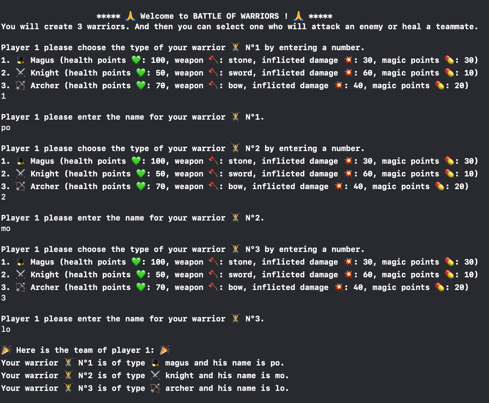
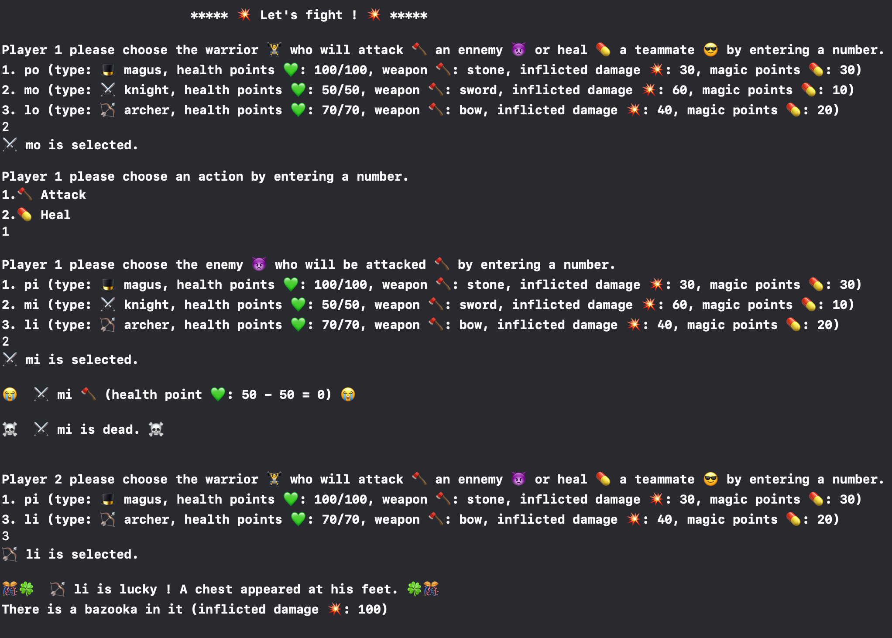
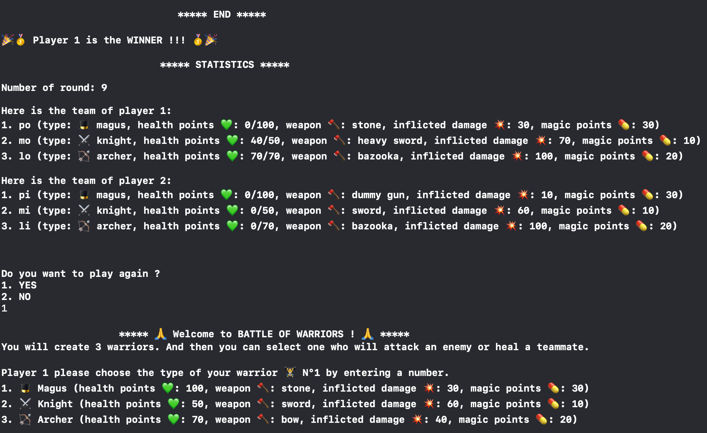

# BATTLE OF WARRIORS
This project is the third of the iOS Developer path from OpenClassrooms. It is a Command Line role game.    
There are 3 phases in the game.

## Initialization Phase
The 2 players build a team of 3 warriors with a specific type (magus, knight, archer) and a unique name.

## Fighting Phase
Each player choose a warrior and an action type: attack or heal.

### Chest
Chests containing a weapon more or less powerful than the one already in possession may appear to a warrior when it is his turn if he has chance.

### Weapons
There are 11 weapons in the game. Each type of warrior can use 5 weapons.

#### All Warriors

- dummy gun (10)
- bazooka (100)

#### Magus

- light stone (20)
- stone (30)
- heavy stone (40)

#### Knight

- light sword (50)
- sword (60)
- heavy sword (70)

#### Archer

- light bow (30)
- bow (40)
- heavy bow (50)

  

## Ending Phase
The winner, the number of round and the composition of each team are displayed.  
We ask if the players want to play again.

